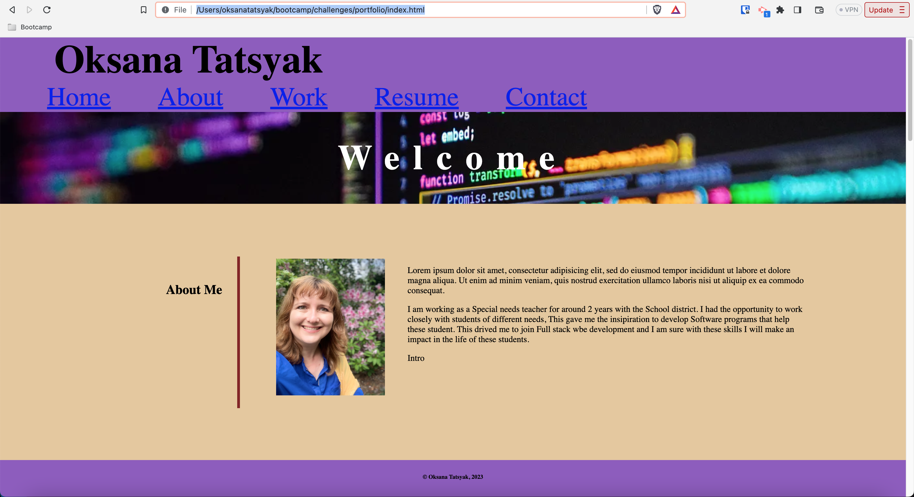

## Professional-Webpage-Portfolio
Deploy a portfolio of a potential employee's previous work

## Table of Contents
[Horiseon Landing Page](#horiseon-landing-page)
[Table of Contents](#table-of-contents)
[Installation](#installation)
[Usage](#usage)
[Credits](#credits)
[License](#license)

## Installation
Clone the repository or download the ZIP file to your local machine. Open the index.html file in your web browser to view the landing page.
https://github.com/OksanaTak/portfolio

## Usage
Dyanmic professional profile of a young upstart full stack web developer. The page allows for navigation to an about section, portfolio section, and a contact section. There are also links to current projects

## Credits
The code for this landing page was provided by Horiseon Social Solution Services, Inc.

## License
This landing page is licensed under the [MIT License](https://opensource.org/licenses/MIT).

## Screenshot

Link
[GitHub](https://github.com/OksanaTak/portfolio)
file:///Users/oksanatatsyak/bootcamp/challenges/portfolio/index.html

